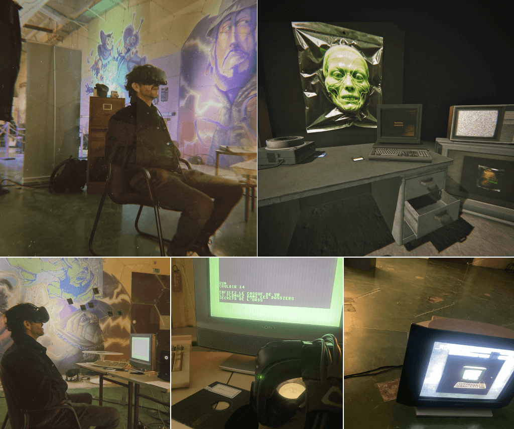

# Couloir 14

> VR installation to embark the visitor in an archive of (imaginary) lost+found documents.

This project aims to create an installation that blurs the lines between the physical and virtual worlds. By utilizing GAN technology (Midjourney) on photos from my personal collection, I have generated dozens of images that simulate a lost and rediscovered archive of a research center deep in the heart of the late 1970s USSR.

## Concept

This project leverages GAN technology (Midjourney, SDXL) to create images that depict ghostly figures and atypical buildings inspired by the city known as ["Arzamas-16"](https://en.wikipedia.org/wiki/Sarov). The installation is both physical and virtual, where visitors sit in a chair facing a desk adorned with various documents and objects, including a CRT television. When visitors put on the VR headset, they are immersed in a space that mirrors the physical setup, with the physical and virtual tables aligning to enhance the immersive experience. The virtual environment elevates the physical installation, with the virtual television displaying a series of documents and generated photos projected on a giant screen in VR. This experience is further enriched by a spatialized soundscape and the images are grouped by themes such as **Arzamas-16**, **Fantomy**, **Hazmat**, **Netzwerk** and **Radiograf**.

- [Artist's statement (French)](img/intention-Couloir-14-FR.pdf)
- Artist's statement (English) / NA

## Technical Details

- **Hardware**: 
  - PC with 2 video outputs (HDMI and Display port)
  - HTC Vive VR headset
  - CRT 4:3 Color Television set with scart input
  - HDMI to Scart adapter

- **Software**: 
  - HARFANG 3D
  - Lua

## Installation Setup

1. **Physical Setup**:
    - A chair facing a desk with various documents and objects.
    - A CRT television placed on the floor, next to the desk.

2. **Virtual Setup**:
    - Develop a virtual environment that mirrors the physical setup using HARFANG 3D and Lua.
    - Align virtual objects with physical ones for a seamless experience.
  
3. **How to run it**:
    - Download either the whole [archive](https://github.com/astrofra/art-couloir-14/archive/refs/heads/main.zip) or the [latest release](https://github.com/astrofra/art-couloir-14/releases)
    - Unzip the file
    - Start `SteamVR` and make sure the VR headset is up and running
    - Run `app/1-build.bat` (will take a couple of minute, you only have to do this once)
    - run `app/2-start.bat`

4. **Misc documents**:
    - [Notice (French)](img/cartel-Couloir-14-FR.pdf)
    - [Notice (English)](img/cartel-Couloir-14-EN.pdf)

## Themes and Imagery

The generated images are categorized into several themes:
- **Arzamas-16**: Depictions of the secretive Soviet city.
- **Fantomy**: Ectoplasmic entities wandering endlessly, remnants of failed experiments.
- **Hazmat**: The tragic story of cosmonauts-turned-construction workers, trapped in an endless building project.
- **Netzwerk**: A network of decaying infrastructure, symbols of overengineered yet abandoned connectivity.
- **Radiograf**: Ghostly depictions of radiographic imprints and experimental technology.

## Sound Design

- Develop a (spatialized) soundscape to accompany the visuals.
- Ensure the sound enhances the thematic elements of the installation.
